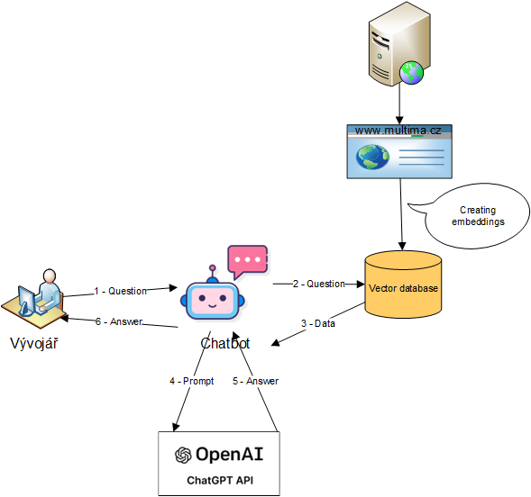
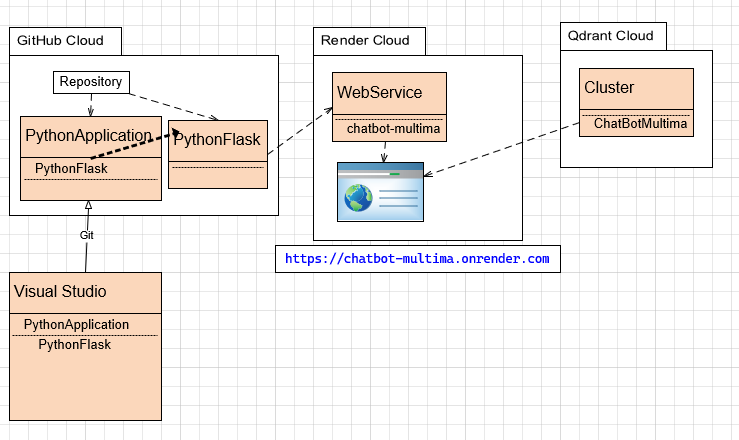
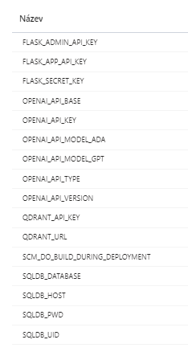

An AI Chatbot-Multima using Python and Flask


##  Knowledge Base Assistant

Rest API server for chatbot implementation. Include an operations for create an Chatbot on defined Knowledge base.
It uses data from www.multima.cz and the embedding technique.
Embeddings are stored in the Qdrant vector database.

Service works as a smart virtual AI assistant. It only supports talking abilities. The bot manages more than 100 world languages. Each question is analyzed and the correct language is determined. The answer is created in the language of the question.
All questions/answers are recorded in a SQL database and can be used for further analysis (frequency analysis and clustering).




## Requirements (libraries)
1. Flask - framework for web application
2. Flask-HTTPAuth - Simple extension that provides Basic and Digest HTTP authentication for Flask routes.
2. openai - ChatBot GPT API
3. load-dotenv - processing environment variable
4. chromadb - Chromadb database API (ver 0.3.29 needed for compatibility with sqlite3)
5. tiktoken - GPT2 tokenizer
6. qdrant - Qdrant vector database
7. psycopg2 - PostgreSQL database API
8. gunicorn - LINUX server for web application running
9. langchain - framework for developing applications powered by language models
10. langchai-openai - Langchain support for OpenAI



Python applications are developed in Visual Studio 2022 in the PythonApplication solution. The server is implemented in the PythonFlaskRestApi project. Class KBAQnA is implemented in PythonLangchain project. The solution is synchronized with the Python GitHub repository. To use the Azure cloud, the PythonFlaskRestApi project must be in a separate repository. Then the PythonFlaskRestApi project is copied to the PythonFlaskRestApi repository. It is then used in Azure to create a RestAPI web service. This application runs on the Gunicorn application server on LINUX. For embedding, the Qdrant database is used, which runs in the Qdrant cloud on the ChatBotMultima cluster.
GitHub cloud and Qdrant cloud are used in free mode. Which brings restrictions on the use of resources.

**GitHub cloud**

GitHub Community Support   
Dependabot alerts  
Deployment protection rules for public repositories  
Two-factor authentication enforcement  
500 MB GitHub Packages storage  
120 GitHub Codespaces core hours per month  
15 GB GitHub Codespaces storage per month  

GitHub Actions features:  
2,000 minutes per month  
Deployment protection rules for public repositories

**Qdrant cloud** (see https://qdrant.tech/pricing/)
0,5 CPU  
1 GB memory  
20 GB disc  

memory_size = number_of_vectors * vector_dimension * 4 bytes * 1.5


## Visual Studio SetUp
1. Create solution PythonApplication
2. Create Project PythonFlask
3. Create a python virtual environment for chatbot

Run ```pip install -U Flask``` to install ```flask```  
Run ```pip install -U openai``` to install ```openai```  
Run ```pip install -U load-dotenv``` to install ```dotenv```  
Run ```pip install -U tiktoken``` to install ```tiktoken```  
Run ```pip install -U qdrant-client``` to install ```Qdrant```  
Run ```pip install -U gunicorn``` to install ```gunicorn```  
Run ```pip install -U langchain``` to install ```langchain```  
Run ```pip install -U langchain-openai``` to install ```langchain-openai```  

5. Create requirements.txt from virtual environment.  
6. Add solution to source Control (GitHub. Repository = PythonApplication)  
7. To access your bot on localhost, go to ```http://127.0.0.1:5000/ ``` 

From requirements.txt remove pywin32==306 before installation in cloude (Azure).

## GitHub SetUp
Repository PythonApplication is created from VisualStudio.

https://github.com/vdedourek2

Gitlab repository

https://gitlab.multima.cz/mm-products/kba

Create **PythonFlaskRestApi** repository and copy from PythonFlaskRestApi project.
Delete env. file in FlaskRepository.
Delete pywin32 from requirements.txt.

## Qdrant setup
https://cloud.qdrant.io/

Create cluster with vector database 1536 dimension in Qdrant cloud. Get URL and API_KEY.


## Azure setup
https://portal.azure.com/#@MULTIMA.onmicrosoft.com/resource/subscriptions/772110ea-7480-452e-9558-9a0cb2fa9b24/resourceGroups/Multima-chatbot/providers/Microsoft.Web/sites/appmultimachatbot/appServices

Create Web service from GitHub repository PythonFlaskRestApi.

SetUp environment variables:  
QDRANT_URL=  
QDRANT_API_KEY=  

FLASK_SECRET_KEY=

OPENAI_API_TYPE=azure
AZURE_OPENAI_ENDPOINT=
AZURE_OPENAI_API_KEY= 
OPENAI_API_MODEL_ADA=ada
OPENAI_API_MODEL_GPT=gpt35	# gpt35, gpt4, gpt35_1106
OPENAI_API_MODEL_GPT4=gpt4
OPENAI_API_MODEL_GPT35=gpt35_1106
OPENAI_API_VERSION=2023-10-01-preview  

FLASK_ADMIN_API_KEY=
FLASK_APP_API_KEY=

SQLDB_HOST=srvchatbotdb.postgres.database.azure.com
SQLDB_DATABASE=chatbot_projects
SQLDB_UID=
SQLDB_PWD= 

PYTHON_VERSION=3.11.2 



Application is accesible on https://chatbot-multima.onrender.com

When you get error
bash: gunicorn: command not found)
then you have to install gunicorn library to requirments.txt


## Access on web

https://appmultimachatbot.azurewebsites.net/

https://mm-kba-dev.azurewebsites.net/


## Regards,
 > [Multima a.s.](https://www.multima.cz/).
